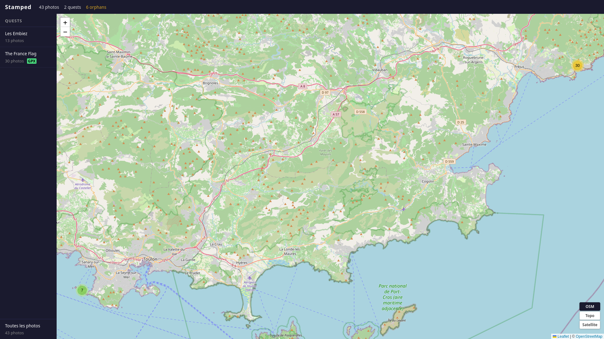
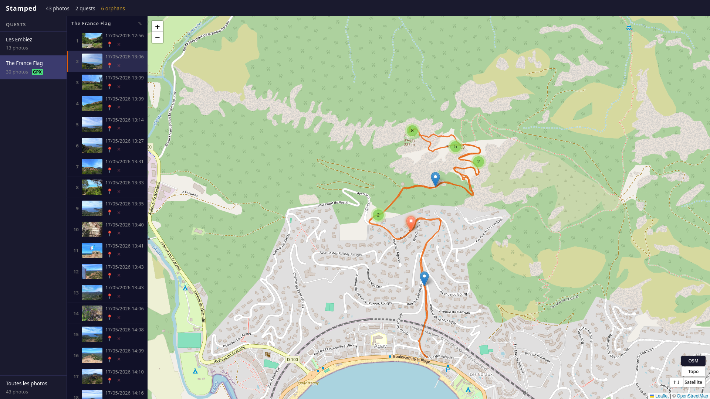
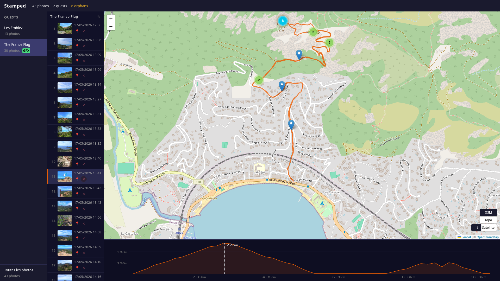
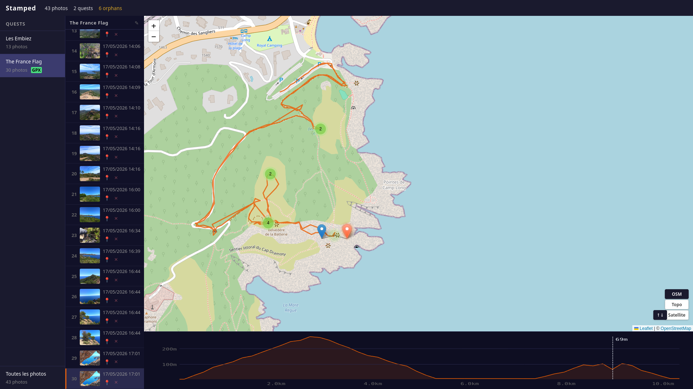
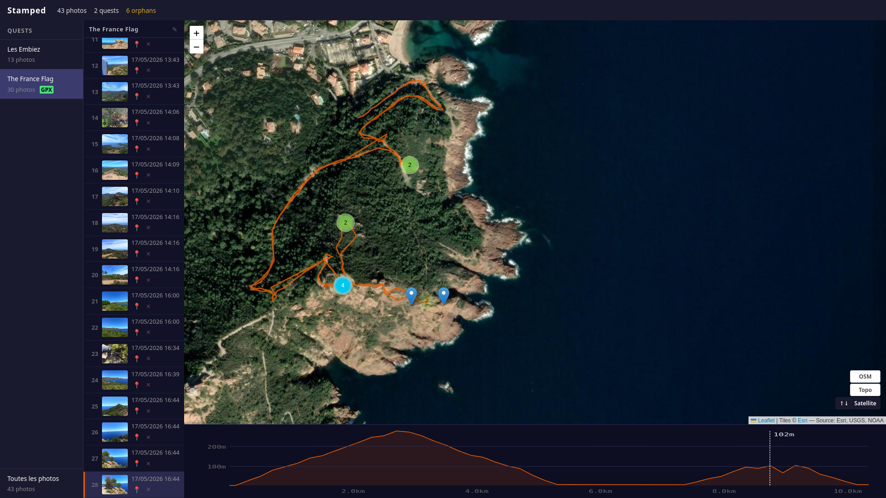

[🇫🇷 Version française](README.fr.md) | 🇬🇧 English version

---

# Stamped

> *A local-first web app that turns your photo library and GPX tracks into a personal conquest map — fully private, nothing leaves your machine.*


[](https://github.com/MarvinLeRouge/Stamped/actions)
[](https://codecov.io/gh/MarvinLeRouge/Stamped)
[](https://codecov.io/gh/MarvinLeRouge/Stamped)


---

## 💡 Concept

Standard photo apps ask you to tag, organize and describe. Stamped doesn't. Point it at a folder, and it reads your EXIF data and GPX tracks, detects your outings automatically, places every photo on a map, and shows you the extent of your documented territory at a glance.

Each geotagged photo is evidence of presence. Stamped treats your collection as a geographic record, not an album.

---

## 📊 Key figures

| Metric | Value |
|---|---|
| Backend tests | **208 passing** |
| Frontend tests | **146 passing** |
| API endpoints | **19** |
| Backend coverage | **99%** |
| Frontend coverage | **97%** |
| Import pipeline stages | **6** (EXIF · GPX · quests · GPS interpolation · elevation · thumbnails) |

---

## 📸 Screenshots

### All quests

[](docs/screenshots/quests-all.png)

### Quest view — elevation profile collapsed

[](docs/screenshots/quest-without-altitude.png)

### Photo marker hover

[](docs/screenshots/quest-hover-marker.png)

### Cluster hover — elevation sync

[](docs/screenshots/quest-hover-cluster.png)

### Opened cluster hover

[](docs/screenshots/quest-hover-opened-cluster.png)

### Alternate OSM layer

[](docs/screenshots/quest-osm-alternate.png)

---

## ✨ Features

- **Conquest map** — all geotagged photos on an OSM map, clustered by zoom level; filter by quest, date range or bounding box
- **Quest detection** — outings auto-detected by temporal clustering (configurable gap); quests renameable
- **Storyline** — per-quest scrollable photo list with timestamps, thumbnails and inline actions
- **GPX support** — import tracks, display per-file polylines, interpolate position for photos without GPS coordinates, export quest GPX
- **Orphan management** — photos without coordinates placed individually on the map (click-to-place) or in bulk via chronological median of quest GPS points
- **Photo deletion** — removes DB record and generated thumbnail; original file is never touched; deleted hashes blocklisted to prevent re-indexing
- **Offline-first** — OSM tiles cached locally after first fetch; elevation data enriched once at import; full offline operation after initial run
- **Private by design** — no account, no cloud sync, no analytics

---

## 🏗️ Architecture

Two-process app: FastAPI backend on `127.0.0.1:8421`, Vue 3 + Vite frontend. See [docs/architecture.md](docs/architecture.md) for the overview, [docs/architecture/backend_architecture.md](docs/architecture/backend_architecture.md) and [docs/architecture/frontend_architecture.md](docs/architecture/frontend_architecture.md) for implementation details, and [docs/adr/](docs/adr/README.md) for the design decisions behind them (including the live-count-vs-cache, deletion-blocklist and median-placement decisions previously listed here).

---

## 📡 API

Full request/response reference: [docs/api/api_endpoints.md](docs/api/api_endpoints.md) - a static, committed reference, since the live Swagger docs at `/docs` are only reachable once the app is installed and running.

---

## 🧪 Testing

### Backend — pytest

```bash
make test-backend
# or
python -m pytest backend/tests/ -v --cov=backend/stamped
```

- Isolated SQLite DB per test (`tmp_path` fixture, no shared state)
- Full import pipeline tested end-to-end with real JPEG and GPX fixtures
- Edge cases: GPS interpolation across file boundaries, cross-activity deduplication, elevation API failure, thumbnail orientation

### Frontend — Vitest

```bash
make test-frontend
# or
cd frontend && npm run test:unit -- --coverage
```

- JSDOM environment, Vue Test Utils
- Pinia stores tested in isolation
- Component tests cover: map interactions, placement mode, lightbox, storyline rename/delete/place flow

### Run everything

```bash
make test
```

---

## ⚙️ CI

[`ci.yml`](.github/workflows/ci.yml) — triggers on push and pull request:

1. **Lint** — ruff, mypy (backend) · ESLint, Prettier, vue-tsc (frontend)
2. **Backend tests** — pytest with coverage, uploaded to Codecov (`backend` flag)
3. **Frontend tests** — Vitest with coverage, uploaded to Codecov (`frontend` flag)
4. **Pre-push hook** — vue-tsc type-check runs locally before any push

---

## 🚀 Getting started

**Prerequisites** — Python 3.12+, Node.js 18+

```bash
git clone https://github.com/MarvinLeRouge/Stamped.git && cd Stamped

# Backend
python -m venv .venv && source .venv/bin/activate
pip install -e ".[dev]"

# Frontend
cd frontend && npm install && npm run build && cd ..

# Start (opens browser automatically at http://localhost:8421)
stamped start

# Import a folder of photos and GPX files
curl -X POST http://localhost:8421/api/import -H "Content-Type: application/json" -d '{"path": "/home/you/Photos/2024/hiking"}'
```

Note: the `stamped index <path>` CLI command described in earlier versions of this README is currently a stub and does not trigger an import. The `POST /api/import` call above is the only working way to start one today - see [docs/operations.md](docs/operations.md) for details and [docs/roadmap.md](docs/roadmap.md) for the plan to wire the CLI command up.

Optional — camera UTC offset (for GPS interpolation accuracy):

```bash
# .env
STAMPED_CAMERA_UTC_OFFSET_HOURS=2   # e.g. CEST
```

---

## 🔒 Privacy

Stamped makes three optional outbound network calls:

| Call | When | Cached |
|---|---|---|
| OSM tiles | First map view of a zone | Locally, forever |
| OpenTopoData | At import only | In SQLite |
| Nominatim | Quest geocoding | In SQLite |

After the first import of a geographic area, Stamped works entirely offline.

---

## 🗺️ Roadmap

v1 and v2 are delivered; v3 (quest macro timeline, folder watch, RAW support, exports, activity tagging, dark theme, keyboard shortcuts) is planned. Full detail: [docs/roadmap.md](docs/roadmap.md).

---

## 🛠️ Tech stack

| Layer | Technology |
|---|---|
| Backend |   |
| Database |  versioned SQL migrations |
| Frontend |   |
| Map |  + Leaflet.markercluster |
| State |  |
| EXIF | Pillow |
| Backend testing |  — 208 tests, 99% coverage |
| Frontend testing |  + Vue Test Utils — 146 tests, 97% coverage |
| Linting | ruff · mypy · ESLint · Prettier · vue-tsc |
| CI |   |

---

## 📋 License

This project is licensed under the MIT License — see the [LICENSE](LICENSE) file for details.

---

*Solo project · Local-first · No tracking · No ads*
